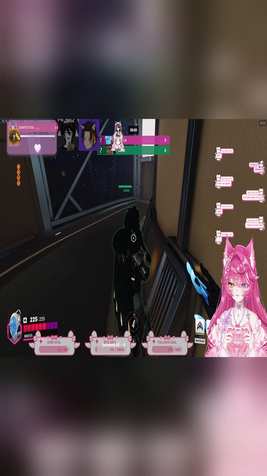
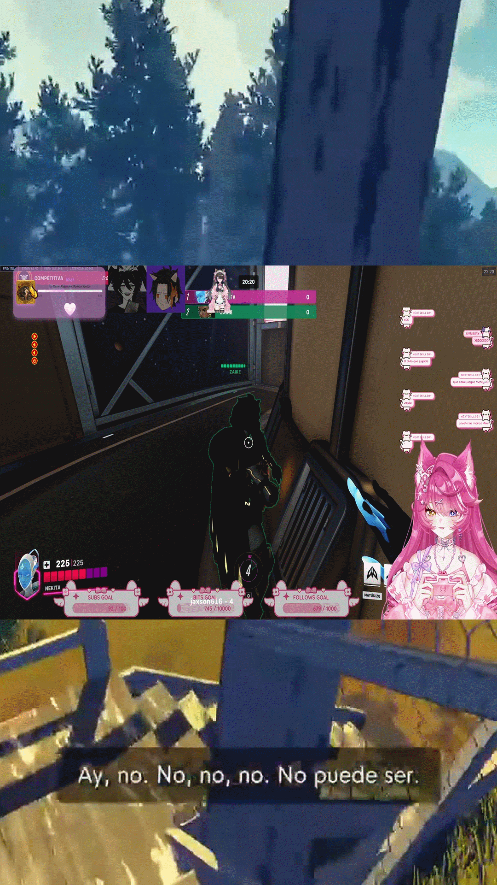
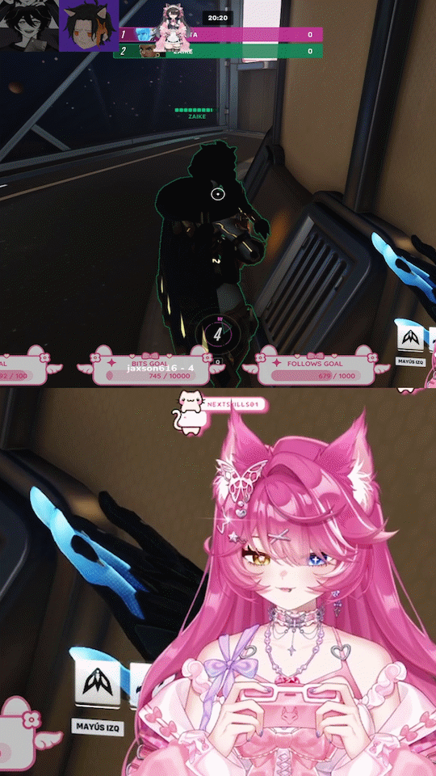
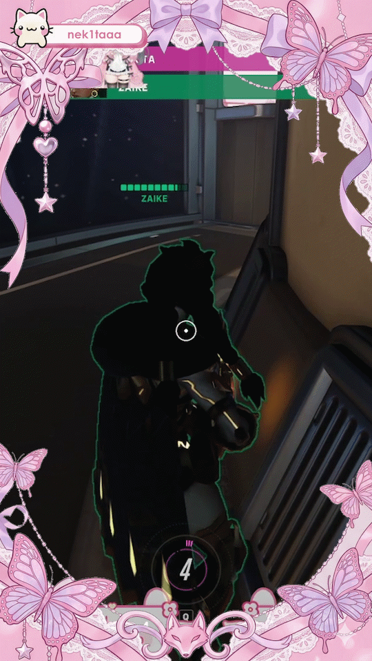

# JSON Plano (Template) Format for YT ShortMaker

"Planos" are JSON files that define the visual composition of your Shorts. They allow you to position the original video, add overlays, effects, and animated backgrounds.

## Basic Structure

A plano is an **array** of objects. Order matters: the first objects are drawn at the back, and the last ones at the front (layers).

```json
[
  { "type": "shader", ... }, // Background (Layer 0)
  { "type": "clip", ... },   // Middle (Layer 1)
  { "type": "image", ... }   // Front (Layer 2)
]
```

## Common Properties: Position and Size

Almost all objects have a `position` property with `x`, `y`, `width`, and `height`.

Values can be:
*   **Integers**: Exact pixels (e.g., `1080`, `1920`).
*   **Keywords**:
    *   `"center"` (for `x` or `y`): Centers the object.
    *   `"full"` (for `width` or `height`): Fills the available size (1080x1920).
    *   **Percentages**: Strings ending in `%` (e.g., `"50%"`).

```json
"position": {
  "x": "center",
  "y": 0,
  "width": "100%",
  "height": "50%"
}
```

## Object Types

### 1. Clip (`clip`)
Represents the source video being processed. You can use it multiple times.

*   `type`: "clip"
*   `position`: (Optional) Video position. Default: full.
*   `crop`: (Optional) Crop of the source video.
    *   Defines a crop window in pixels on the original video.
    *   `x_from`: Start pixel left (e.g., 0).
    *   `x_to`: End pixel right (e.g., 1920). If greater than `x_from`, crops width.
    *   `y_from`: Start pixel top (e.g., 0).
    *   `y_to`: End pixel bottom (e.g., 1080). If greater than `y_from`, crops height.
    *   Cropping applies **before** scaling or positioning.
    *   **Example:** To crop a 1920x1080 video to a center 1080x1080 square:
        ```json
        "crop": {
          "x_from": 420,  // (1920 - 1080) / 2 = 420
          "x_to": 1500    // 420 + 1080 = 1500
        }
        ```
*   `fit`: (Optional) Fit mode. Values: `"stretch"` (default, stretches), `"cover"` (crops), `"contain"` (letterbox).
*   `comment`: (Optional) User note.

### 2. Image (`image`)
Overlays a static image (png, jpg). Ideal for frames, logos, or watermarks.

*   `type`: "image"
*   `path`: Path to the image file (absolute or relative to json).
*   `position`: Position and size.
*   `opacity`: Opacity from 0.0 to 1.0 (Default: 1.0).

### 3. Video (`video`)
Background or overlay video (e.g., background gameplay, particle effects).

*   `type`: "video"
*   `path`: Path to the video file.
*   `position`: Position and size.
*   `loop_video` (optional, bool): If `true`, the video loops if shorter than clip. Default `true`.
*   `keep_last_frame` (optional, bool): If `loop_video` is `false`, keeps the last frame frozen until the end. Default `false`.
*   `opacity` (optional, float): Video opacity (0.0 to 1.0). Default `1.0`.
*   `fit`: (Optional) Fit mode. Values: `"stretch"` (default), `"cover"`, `"contain"`.

### 4. Shader (`shader`)
Applies a visual effect to what is behind it. Currently supports blur.

*   `type`: "shader"
*   `effect`: Effect configuration object.
    *   `type`: "blur"
    *   `intensity`: Blur intensity (e.g., 20).
*   `position`: Area where the effect applies.

## Complete Example

```json
[
  // 1. Blurred background (Stretched original video + Blur)
  {
    "type": "clip",
    "position": { "x": 0, "y": 0, "width": "full", "height": "full" },
    "comment": "Base blurred background"
  },
  {
    "type": "shader",
    "effect": { "type": "blur", "intensity": 30 },
    "position": { "x": 0, "y": 0, "width": "full", "height": "full" }
  },

  // 2. Main video centered
  {
    "type": "clip",
    "position": { "x": "center", "y": "center", "width": "100%", "height": "40%" },
  },

  // 3. Watermark
  {
    "type": "image",
    "path": "./logo.png",
    "position": { "x": "center", "y": 1700, "width": 200, "height": "auto" },
    "opacity": 0.8
  }
]
```

## Common Use Cases and Examples

Here are several practical examples. Copy and paste the JSON code into your `.json` plano file.

### 1. Simple Blur Background (Default)
The original video is used as a background (stretched and blurred) and also as the main element in the center.



```json
[
  {
    "type": "clip",
    "position": {
      "width": "full",
      "height": "full"
    },
    "fit": "stretch",
    "comment": "Stretched background"
  },
  {
    "type": "shader",
    "effect": {
      "type": "blur",
      "intensity": 20
    },
    "position": {
      "width": "full",
      "height": "full"
    }
  },
  {
    "type": "clip",
    "position": {
      "x": "center",
      "y": "center",
      "width": "100%",
      "height": "40%"
    },
    "comment": "Main video"
  }
]
```

### 2. Gameplay Background (External Video)
A "gameplay" video (e.g., Minecraft, GTA) loops in the background, with the original video centered.



```json
[
  {
    "type": "video",
    "path": "./media/gameplay_background.mp4",
    "position": { "width": "full", "height": "full" },
    "loop_video": true,
    "fit": "cover",
    "opacity": 1.0,
    "comment": "Looping background video"
  },
  {
    "type": "clip",
    "position": { "x": "center", "y": "center", "width": "100%", "height": "40%" },
    "comment": "Main clip over gameplay"
  }
]
```

### 3. Split Screen
Two videos stacked vertically. Useful for comparisons or reaction videos.
(Here we use the same clip twice, but you could use `video` for the second one).



```json
[
  {
    "type": "clip",
    "position": {
      "x": 0,
      "y": 0,
      "height": "50%"
    },
    "crop": {
      "x_from": 420,
      "x_to": 1500
    },
    "comment": "Top part"
  },
  {
    "type": "clip",
    "position": {
      "x": 0,
      "y": "50%",
      "width": "100%",
      "height": "50%"
    },
    "crop": {
      "x_from": 1300,
      "x_to": 1920,
      "y_from": 500,
      "y_to": 1080
    },
    "comment": "Bottom part"
  }
]
```

### 4. Frame / Overlay
Video with a transparent PNG image overlaid (frame, stats, branding).



```json
[
  {
    "type": "clip",
    "position": { "width": "full", "height": "full" },
    "fit": "cover"
  },
  {
    "type": "image",
    "path": "./media/frame_overlay.png",
    "position": { "x": 0, "y": 0, "width": "full", "height": "full" },
    "opacity": 1.0,
    "comment": "PNG image with transparency"
  }
]
```

